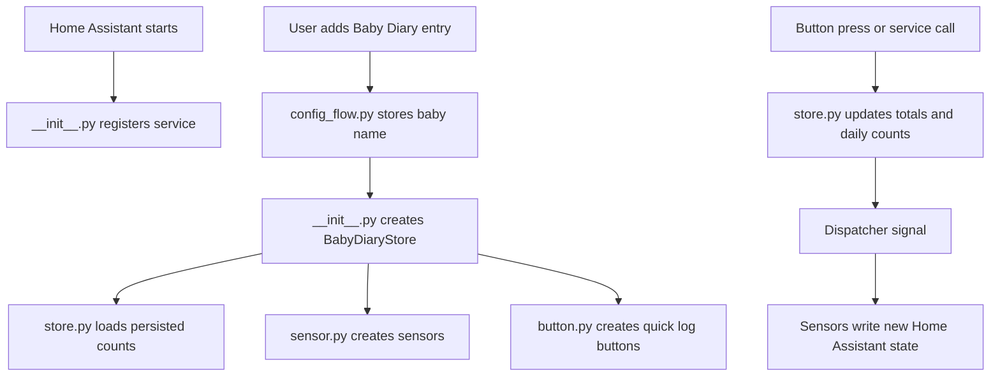

# Python Files Explained

This page explains what each `.py` file does in the Baby Diary Home Assistant integration.

## Runtime Flow



## `__init__.py`

`custom_components/baby_diary/__init__.py` is the integration entry point.

It is responsible for:

- registering the `baby_diary.log_diaper_change` action
- loading and unloading config entries
- creating one `BabyDiaryStore` per baby
- forwarding each config entry to the `button` and `sensor` platforms
- registering the frontend JavaScript file as a static Home Assistant path
- loading the frontend module into the browser with `add_extra_js_url`
- routing service calls to the correct baby

It keeps shared runtime objects in `hass.data[DOMAIN]`. This is the usual Home Assistant pattern for integration state that needs to be shared between platforms.

Important helper functions:

| Function | Purpose |
| --- | --- |
| `async_setup` | Runs once for the integration and registers the service |
| `async_setup_entry` | Runs for each configured baby |
| `async_unload_entry` | Cleans up one configured baby |
| `_async_register_frontend` | Serves and loads `frontend/baby-diary.js` |
| `_get_store_for_service` | Finds the correct baby store from `entry_id`, `baby_name`, or the single configured entry |

## `config_flow.py`

`custom_components/baby_diary/config_flow.py` powers the **Add integration** wizard.

It asks for the baby name, trims it, and uses Home Assistant's `slugify` helper to create a unique ID. That unique ID prevents adding the same baby twice.

This file exists because `manifest.json` has:

```json
"config_flow": true
```

Without this file, the integration could not be added from the Home Assistant UI.

## `const.py`

`custom_components/baby_diary/const.py` contains shared constants.

Examples:

- integration domain: `baby_diary`
- supported diaper types: `xixi`, `coco`, `ambos`
- supported metrics: `diapers`, `xixi`, `coco`
- service name: `log_diaper_change`
- Home Assistant platforms: `button` and `sensor`
- shared `hass.data` keys

Keeping these values in one file avoids small naming mismatches across the integration.

## `store.py`

`custom_components/baby_diary/store.py` owns the counters.

It contains the `BabyDiaryStore` class. There is one store instance per baby/config entry.

It is responsible for:

- loading persisted data with Home Assistant's `Store` helper
- saving counts after every logged diaper
- keeping lifetime totals
- keeping daily totals
- resetting daily totals after local midnight
- notifying sensors when values change
- exposing device information so entities are grouped under one Baby Diary device

Stored data uses the key:

```text
baby_diary.<entry_id>
```

Home Assistant stores that under its `.storage` directory.

Counting logic lives here:

| Logged type | Updated metrics |
| --- | --- |
| `xixi` | `xixi`, `diapers` |
| `coco` | `coco`, `diapers` |
| `ambos` | `xixi`, `coco`, `diapers` |

That is why `ambos` counts as one diaper while still incrementing both xixi and coco.

## `sensor.py`

`custom_components/baby_diary/sensor.py` creates the sensor entities.

For each baby, it creates:

- lifetime diaper total
- lifetime xixi total
- lifetime coco total
- daily diaper total
- daily xixi total
- daily coco total

The sensors are not polled. They subscribe to the store's dispatcher signal and write a new Home Assistant state only when the store changes.

The sensors use:

```python
SensorStateClass.MEASUREMENT
```

This tells Home Assistant that the values are measurements that can be recorded and shown in history.

## `button.py`

`custom_components/baby_diary/button.py` creates quick log button entities.

For each baby, it creates:

- `Log Xixi`
- `Log Coco`
- `Log Ambos`

Pressing a button calls `BabyDiaryStore.async_log_diaper_change` with the correct diaper type.

These are Home Assistant button entities. They are useful for dashboards, automations, voice helpers, and any Home Assistant feature that can press a button entity.

## Why The Frontend Is Not Python

The dashboard card, icons, and browser palette live in:

```text
custom_components/baby_diary/frontend/baby-diary.js
```

Python code runs on the Home Assistant backend. Custom dashboard cards and iconsets run in the browser, so they need JavaScript.
